# The Cyborg Architecture: Engine 4.0

## 1. System Philosophy: The Iron Man Model

This document defines the architecture of **Engine 4.0**, a specific pivot away from "Autonomous AI" towards **"AI-Augmented Human Operations"**.

We acknowledge the **"Hallucination Barrier"** (AI cannot be trusted with final verdicts) and the **"ARA Barrier"** (AI cannot creatively bypass Runtime Protection). Therefore, the system is designed not to replace the Penetration Tester, but to act as their **Exoskeleton**.

*   **The Kernel (Decision)**: The Human Engineer.
*   **The Exoskeleton (Tactics)**: The MCP Agents.
*   **The Tools (Physics)**: The Device & Network Layer.

---

## 2. The Cyborg Stack

The architecture is layered to maximize the strengths of both biological and artificial intelligence.

```mermaid
graph TD
    subgraph KERNEL ["👤 The Human Kernel (Decision & Creativity)"]
        Engineer[Security Engineer]
    end

    subgraph EXOSKELETON ["🤖 The AI Exoskeleton (Tactics & Speed)"]
        Triage[Triage Assistant]
        Fuzzer[Tactical Fuzzer]
        Scribe[Artifact Scribe]
    end

    subgraph TOOLS ["🔧 The Tool Layer (Deterministic)"]
        MobSF[MobSF MCP]
        Frida[Frida Script Generator]
        ADB[ADB Controller]
    end

    %% Connections
    Engineer -->|Command: 'Analyze this'| Triage
    Triage -->|Data: 'Risk Map'| Engineer
    
    Engineer -->|Command: 'Breach Auth'| Fuzzer
    Fuzzer -->|Action: 'Fuzzing...'| ADB
    Fuzzer -->|Result: 'Crash Log'| Engineer
    
    Engineer -->|Verdict: 'Confirmed'| Scribe
    Scribe -->|Doc: 'Report'| Engineer
```

### 2.1 The Kernel: The Human Engineer
The human is the **Single Source of Truth**.
*   **Responsibility**:
    *   **Context Management**: The human decides *what* matters.
    *   **Creative Breach**: Logic bugs and Anti-Tamper (ARA) bypasses are handled largely by human intuition, aided by AI code generation.
    *   **Final Verdict**: No finding is "True" until the human says so.

### 2.2 The Exoskeleton: MCP Agents
AI Agents act as specialized assistants, invoked via ChatOps or IDE Commands.

*   **The Triage Assistant**:
    *   *Role*: "The Filter".
    *   *Task*: Scans the huge volume of static analysis data (MobSF).
    *   *Output*: "Here are the top 5 suspicious entry points. Ignore the other 95." (Reduces noise, does not decide truth).
*   **The Tactical Fuzzer**:
    *   *Role*: "The Machine Gunner".
    *   *Task*: Once the human points to a target (e.g., "Attack that Search Bar"), the Fuzzer generates and fires 1,000 payload variations.
*   **The Artifact Scribe**:
    *   *Role*: "The Secretary".
    *   *Task*: Collects logs, screenshots, and HTTP flows flagged by the human and formats them into a flexible report.

---

## 3. Data Flow: The "Workbench" Model

Unlike the previous "Pipeline" model (which implies a straight line), the Cyborg model uses a **Workbench** approach. The APK sits on the bench, and the Human/AI pair iteratively work on it.

1.  **Ingestion**: 
    *   *AI*: Parses Manifest, Decompiles.
    *   *Human*: Reviews the "Attack Surface Summary" generated by AI.
2.  **The Loop (Iterative Hacking)**:
    *   *Human*: "I see a `checkSignature` function. AI, explain this Smali code."
    *   *AI*: "It compares the APK signature against a hardcoded hash."
    *   *Human*: "Write a Frida hook to return `true` for that function."
    *   *AI*: Generates the script.
    *   *Human*: Refines the script (fixing AI hallucinations/syntax errors) and injects it.
    *   *AI*: Monitors the logs for success.
3.  **Completion**:
    *   *Human*: "We are in. Validated."
    *   *AI*: Saves the session state to the database.

---

## 4. Addressing the Barriers

| Barrier            | Previous "Autonomous" Failure                                                 | Engine 4.0 "Cyborg" Solution                                                                                                                          |
| :----------------- | :---------------------------------------------------------------------------- | :---------------------------------------------------------------------------------------------------------------------------------------------------- |
| **Hallucination**  | AI reports fake bugs; Auditor loops forever trying to prove them.             | **Human Filter**: Only Human-verified bugs enter the database. AI only *suggests*.                                                                    |
| **ARA Defenses**   | AI gets blocked by Root Detection and retries blindly until Context explodes. | **Human Breach**: Human identifies the RASP mechanism and writes the specific bypass. AI helps write the boilerplate.                                 |
| **Context Limits** | Entire session history stuffed into Token Window.                             | **Session Slicing**: AI only sees the *current* task's context (e.g., "The current Activity's code"). Global state is offloaded to the Human's notes. |

---

## 5. Technical Specifications

### The "Co-Pilot" Interface
*   **IDE**: VS Code / Cursor / Android Studio.
*   **MCP Integration**: The AI lives in the Sidebar (Chat), not as a background process.
*   **Tools**:
    *   **Command Palette**: Human triggers actions like `@Android /screenshot` or `@MobSF /scan`.
    *   **Inline Assist**: Human highlights code -> "Explain this" or "Generate Hook".

This architecture accepts that AI is imperfect and leverages it for **Speed and Scale**, while reserving **Correctness and Creativity** for the Human.
