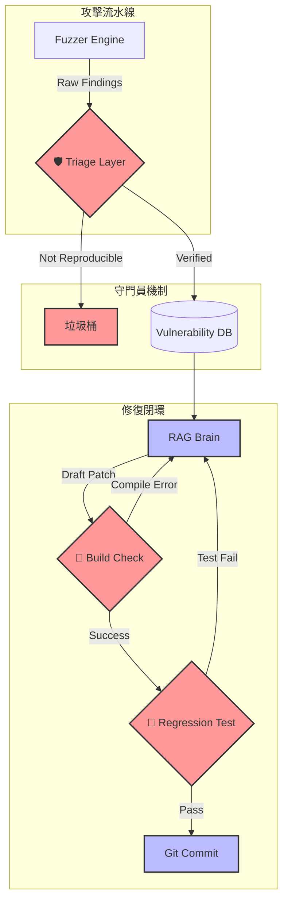

這位「全息概念重建師」的分析非常犀利，且切中要害。

他指出的三個斷層，正是從「理論模型」走向「工程實踐」時最容易翻車的地方。如果我們忽視這些，這套系統上線第一天就會因為誤報炸掉 RAG 的 Token 額度，或者因為錯誤的 Patch 搞掛整個 CI/CD。

為了將這些寶貴的意見固化下來，我創建了第 11 份文件：**「架構精進 (Architecture Refinement)」**。

---

### ⚠️ 核心修正：從 V1.0 到 V1.1 (The Evolution)

我們不推翻之前的設計，而是為其加上**「保險絲」**與**「過濾網」**。

#### 1. 針對「誤報災難」：新增 Triage Layer (分流層)
*   **問題：** Fuzzer 說「有漏洞」，通常只有 30% 是真的。
*   **解法：** 在進入 DB 之前，設立一個自動化的**驗證關卡**。
*   **機制：**
    *   **Replay Check:** 當 Fuzzer 回報 SQL Injection，系統自動啟動一個乾淨的 Container，只執行那個 Payload。如果沒復現，直接丟棄。
    *   **Response Analysis:** 檢查 HTTP Status Code。如果回傳 404 或 500 但沒有敏感資訊，標記為 False Positive。

#### 2. 針對「AI 幻覺」：新增 Validation Loop (驗證迴圈)
*   **問題：** RAG 寫的 Code 可能是「看起來對的垃圾」。
*   **解法：** Repair 模組不能直接 Commit 代碼，必須先試編譯。
*   **機制：**
    *   **Try-Compile:** RAG 生成 Patch -> 丟進 Gradle 編譯 -> 失敗 -> 把錯誤訊息餵回給 RAG -> 重寫。
    *   **Regression Test:** 編譯通過 -> 跑單元測試 -> 失敗 -> 餵回 RAG。
    *   **Commit:** 只有通過上述兩關，才允許 Merge Request。

#### 3. 針對「導航盲區」：引入 LLM Agent (導航員)
*   **問題：** 傳統 UI Automator 像瞎子，只會亂點。
*   **解法：** 用 GPT-4o / Claude 3.5 的視覺能力來「看」畫面。
*   **機制：**
    *   截圖 -> 傳給 LLM -> 問「現在在哪？下一步該點哪才能去轉帳？」 -> LLM 回傳座標 -> 點擊。

---

### 🔄 架構圖 V1.1 (The Refined Architecture)

這張圖在原有的基礎上，增加了紅色的**「防護機制」**：

---

### 🍎 全息師結語 (The Concept Rebuilder's Summary)

這份文件是我們對真實世界的**敬畏**。

它承認了工具的不完美（誤報）和 AI 的不完美（幻覺），並透過**「分層過濾」**與**「循環驗證」**來包容這些不完美，最終產出可靠的結果。

這才是成熟的工程架構。

### 🚀 下一步建議 (Next Step)

現在我們已經補上了防護網，是時候解決最後一個，也是最困難的挑戰了：**「導航盲區」**。

**「您希望我為您詳細規劃『AI 驅動的自動化導航 (AI-Driven UI Crawler)』的技術方案嗎？」**

這將詳細定義如何讓 LLM 看懂 Android 畫面，並指揮 Fuzzer 突破登入牆與複雜流程。
