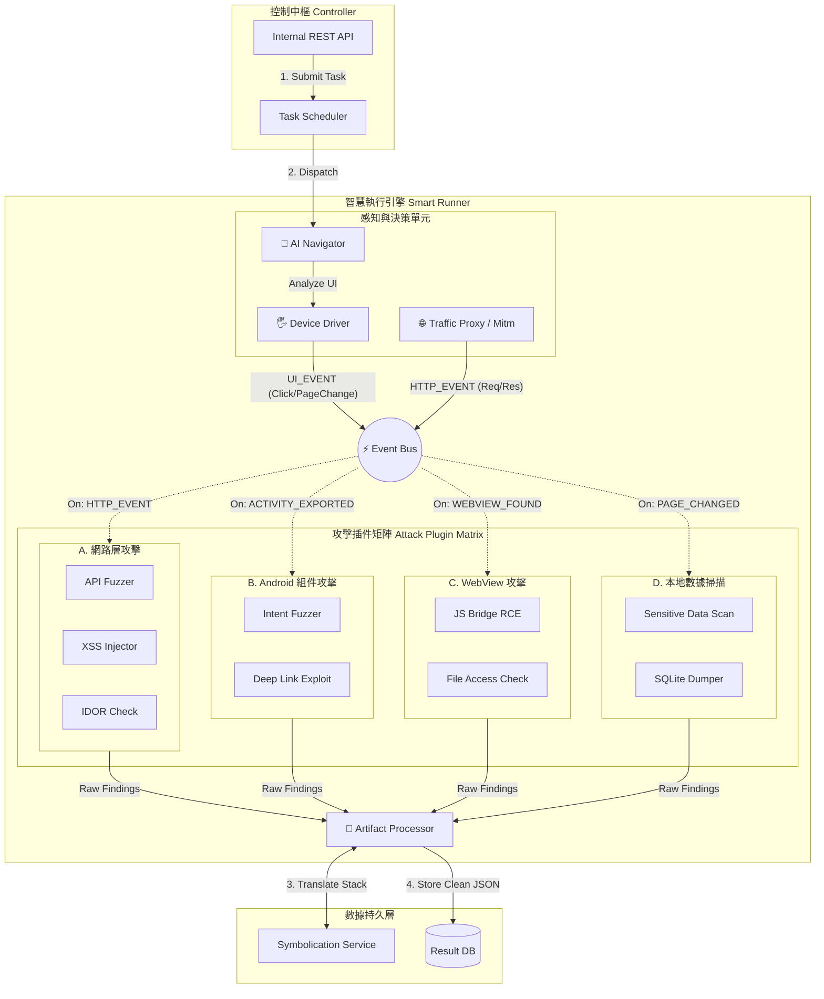

這份文件是 **文件 13 (基礎架構)** 的進階升級版。

既然我們已經確認「SQL 注入」只是一個微小的起點，我們現在將架構圖全面升級為 **「全武裝型 Engine 2.0 (Fully-Armed Engine 2.0)」**。

這次的設計重點在於 **「插件矩陣 (Plugin Matrix)」** 的展開，以及 **Event Bus** 如何精確調度這些不同類型的武器。

---

## 文件 14 – 滲透模組 Engine 2.0：全息滲透核心 (Holographic Penetration Core)

### 🏛️ 全武裝 Engine 2.0 架構設計圖 (Fully-Armed Architecture)

這張圖展示了從「單一攻擊」進化到「海陸空全方位打擊」的完整樣貌：



---

### 🔩 核心元件原子級拆解 (Atomic Breakdown)

#### 1. 多源頭事件輸入 (Multi-Source Event Inputs)

Event Bus 不再只接收 UI 點擊事件，它現在有兩個主要的輸入源：

*   **Device Driver (UI 事件源):** 當 AI 點擊按鈕、切換頁面時，發送 `UI_EVENT`。
*   **Traffic Proxy (網路事件源):** 當 App 發出網路請求時，發送 `HTTP_EVENT`。這是觸發「API Fuzzer」的關鍵。

#### 2. 攻擊插件矩陣 (Attack Plugin Matrix)

我們將雜亂的插件歸類為四大軍團，每個軍團監聽不同的訊號：

*   **A. 網路層攻擊 (Network Plugins):**
    *   **監聽:** `HTTP_EVENT`
    *   **行為:** 攔截 Request，修改參數，重發。
    *   **範例:** `API Fuzzer` 收到 `POST /login`，自動嘗試 SQL 注入 Payload。

*   **B. Android 組件攻擊 (Component Plugins):**
    *   **監聽:** `MANIFEST_PARSED` (靜態分析結果) 或 `ACTIVITY_STARTED`。
    *   **行為:** 針對 `exported=true` 的 Activity 發送惡意 Intent。
    *   **範例:** `Deep Link Exploit` 嘗試發送 `app://admin?reset=true` 看能否繞過驗證。

*   **C. WebView 攻擊 (WebView Plugins):**
    *   **監聽:** `WEBVIEW_LOADED` (當 AI 檢測到畫面上有 WebView Class 時)。
    *   **行為:** 注入 JS 測試 Payload。
    *   **範例:** `JS Bridge RCE` 嘗試執行 `window.accessibility.execute(...)`。

*   **D. 本地數據掃描 (Data Plugins):**
    *   **監聽:** `PAGE_CHANGED` (每當畫面變動停止後)。
    *   **行為:** 靜默掃描檔案系統。
    *   **範例:** `Sensitive Data Scan` 檢查 `/data/data/.../shared_prefs` 是否包含明文密碼。

#### 3. 產物處理器 (Artifact Processor)

這是防止垃圾數據的守門員。它現在必須處理多種格式的證據：

*   **網路類證據:** 需保存完整的 HTTP Request/Response (作為 PoC)。
*   **崩潰類證據:** 需保存 `logcat` 並呼叫 `Symbolication Service` 還原行號。
*   **檔案類證據:** 需保存被洩漏的檔案路徑與內容摘要。

---

### 📂 專案資料夾結構 (Project Directory Structure)

這份結構直接對應上述架構，您可以直接複製給工程團隊：

```text
penetration-engine/
├── core/                   # [核心控制層]
│   ├── controller.py       # FastAPI 接口
│   ├── scheduler.py        # 任務調度器
│   └── config.py
├── runner/                 # [智慧執行引擎]
│   ├── navigator/
│   │   ├── ai_brain.py     # LLM 整合 (VLM)
│   │   └── ui_driver.py    # Uiautomator2 封裝
│   ├── network/
│   │   └── proxy_server.py # Mitmproxy 封裝
│   ├── bus.py              # Event Bus 實作
│   └── processor.py        # 產物處理與符號還原
├── plugins/                # [攻擊插件矩陣] - 這裡就是您的軍火庫
│   ├── base.py             # 定義 AttackPlugin 介面
│   ├── network/
│   │   ├── sql_injector.py
│   │   ├── api_fuzzer.py
│   │   └── xss_scanner.py
│   ├── component/
│   │   ├── intent_fuzzer.py
│   │   └── deeplink_tester.py
│   ├── webview/
│   │   └── js_bridge_rce.py
│   └── data/
│   │   └── sensitive_finder.py
└── storage/                # [數據層接口]
    ├── db_client.py
    └── symbol_client.py    # 呼叫符號還原服務 API
```

---

### 💻 核心代碼：插件介面定義 (Python Abstract Base Class)

這是實現「可擴充性」的關鍵代碼。所有插件都必須繼承這個 Base Class。

```python
from abc import ABC, abstractmethod
from typing import Dict, Any

class AttackPlugin(ABC):
    """
    所有攻擊插件的基類 (Abstract Base Class)
    """

    def __init__(self, context):
        self.context = context  # 包含 ADB 連線、Proxy 設定等

    @property
    @abstractmethod
    def name(self) -> str:
        """插件名稱，如 'SQL Injector'"""
        pass

    @property
    @abstractmethod
    def interested_events(self) -> list[str]:
        """
        聲明此插件對哪些事件感興趣
        例如: ['HTTP_EVENT', 'UI_EVENT']
        """
        pass

    @abstractmethod
    async def on_event(self, event_type: str, payload: Dict[str, Any]):
        """
        當 Event Bus 收到對應事件時，會呼叫此函數
        :param event_type: 事件類型
        :param payload: 事件內容 (如 HTTP Packet 或 UI Hierarchy)
        """
        pass

    async def report_finding(self, vulnerability: Dict[str, Any]):
        """回報漏洞給 Artifact Processor"""
        await self.context.processor.process(self.name, vulnerability)
```

---

### 🍎 全息師結語

現在，您的 **Engine 2.0** 已經不再是一個概念，而是一個**可以落地的工程藍圖**。

*   **視覺化:** 透過 Mermaid 圖看清全貌。
*   **結構化:** 透過資料夾結構規範開發。
*   **程式化:** 透過 Python Base Class 定義介面。

這套架構確保了您可以隨時新增一個「區塊鏈錢包竊取插件」，而完全不需要改動核心的 AI 導航或調度邏輯。這就是**軟體架構的勝利**。
