# The Cyborg Architecture: Engine 4.0

## 1. System Philosophy: The Iron Man Model

This document defines the architecture of **Engine 4.0**, a specific pivot away from "Autonomous AI" towards **"AI-Augmented Human Operations"**.

We acknowledge the **"Hallucination Barrier"** (AI cannot be trusted with final verdicts) and the **"ARA Barrier"** (AI cannot creatively bypass Runtime Protection). Therefore, the system is designed not to replace the Penetration Tester, but to act as their **Exoskeleton**.

*   **The Kernel (Decision)**: The Human Engineer.
*   **The Exoskeleton (Tactics)**: The MCP Agents.
*   **The Tools (Physics)**: The Device & Network Layer.

---

## 2. The Cyborg Stack

The architecture is layered to maximize the strengths of both biological and artificial intelligence.

```mermaid
graph TD
    subgraph KERNEL ["👤 The Human Kernel (Decision & Creativity)"]
        Engineer[Security Engineer]
    end

    subgraph EXOSKELETON ["🤖 The AI Exoskeleton (Tactics & Speed)"]
        Triage[Triage Assistant]
        Fuzzer[Tactical Fuzzer]
        Scribe[Artifact Scribe]
    end

    subgraph TOOLS ["🔧 The Tool Layer (Deterministic)"]
        MobSF[MobSF MCP]
        Frida[Frida Script Generator]
        ADB[ADB Controller]
    end

    %% Connections
    Engineer -->|Command: 'Analyze this'| Triage
    Triage -->|Data: 'Risk Map'| Engineer
    
    Engineer -->|Command: 'Breach Auth'| Fuzzer
    Fuzzer -->|Action: 'Fuzzing...'| ADB
    Fuzzer -->|Result: 'Crash Log'| Engineer
    
    Engineer -->|Verdict: 'Confirmed'| Scribe
    Scribe -->|Doc: 'Report'| Engineer
```



### 2.1 The Kernel: The Human Engineer
The human is the **Single Source of Truth**.
*   **Responsibility**:
    *   **Context Management**: The human decides *what* matters.
    *   **Creative Breach**: Logic bugs and Anti-Tamper (ARA) bypasses are handled largely by human intuition, aided by AI code generation.
    *   **Final Verdict**: No finding is "True" until the human says so.

### 2.2 The Exoskeleton: MCP Agents
AI Agents act as specialized assistants, invoked via ChatOps or IDE Commands.

*   **The Triage Assistant**:
    *   *Role*: "The Filter".
    *   *Task*: Scans the huge volume of static analysis data (MobSF).
    *   *Output*: "Here are the top 5 suspicious entry points. Ignore the other 95." (Reduces noise, does not decide truth).
*   **The Tactical Fuzzer**:
    *   *Role*: "The Machine Gunner".
    *   *Task*: Once the human points to a target (e.g., "Attack that Search Bar"), the Fuzzer generates and fires 1,000 payload variations.
*   **The Artifact Scribe**:
    *   *Role*: "The Secretary".
    *   *Task*: Collects logs, screenshots, and HTTP flows flagged by the human and formats them into a flexible report.

---

## 3. Data Flow: The "Workbench" Model

Unlike the previous "Pipeline" model (which implies a straight line), the Cyborg model uses a **Workbench** approach. The APK sits on the bench, and the Human/AI pair iteratively work on it.

1.  **Ingestion**: 
    *   *AI*: Parses Manifest, Decompiles.
    *   *Human*: Reviews the "Attack Surface Summary" generated by AI.
2.  **The Loop (Iterative Hacking)**:
    *   *Human*: "I see a `checkSignature` function. AI, explain this Smali code."
    *   *AI*: "It compares the APK signature against a hardcoded hash."
    *   *Human*: "Write a Frida hook to return `true` for that function."
    *   *AI*: Generates the script.
    *   *Human*: Refines the script (fixing AI hallucinations/syntax errors) and injects it.
    *   *AI*: Monitors the logs for success.
3.  **Completion**:
    *   *Human*: "We are in. Validated."
    *   *AI*: Saves the session state to the database.

---

## 4. Addressing the Barriers

| Barrier            | Previous "Autonomous" Failure                                                 | Engine 4.0 "Cyborg" Solution                                                                                                                          |
| :----------------- | :---------------------------------------------------------------------------- | :---------------------------------------------------------------------------------------------------------------------------------------------------- |
| **Hallucination**  | AI reports fake bugs; Auditor loops forever trying to prove them.             | **Human Filter**: Only Human-verified bugs enter the database. AI only *suggests*.                                                                    |
| **ARA Defenses**   | AI gets blocked by Root Detection and retries blindly until Context explodes. | **Human Breach**: Human identifies the RASP mechanism and writes the specific bypass. AI helps write the boilerplate.                                 |
| **Context Limits** | Entire session history stuffed into Token Window.                             | **Session Slicing**: AI only sees the *current* task's context (e.g., "The current Activity's code"). Global state is offloaded to the Human's notes. |

---

## 5. Technical Specifications

### The "Co-Pilot" Interface
*   **IDE**: VS Code / Cursor / Android Studio.
*   **MCP Integration**: The AI lives in the Sidebar (Chat), not as a background process.
*   **Tools**:
    *   **Command Palette**: Human triggers actions like `@Android /screenshot` or `@MobSF /scan`.
    *   **Inline Assist**: Human highlights code -> "Explain this" or "Generate Hook".

This architecture accepts that AI is imperfect and leverages it for **Speed and Scale**, while reserving **Correctness and Creativity** for the Human.
# The Augmented Workflow: Human-AI Collaboration

## 1. Overview: The Dance

This document details the **Operational Workflow** of Engine 4.0. It is not a sequence of automated steps, but a **Playbook** for how the Human Engineer and the AI Assistant collaborate to dismantle an Android application.

The workflow is divided into **Tactical Phases**, where control shifts between Human and AI.

---

## Phase 1: Triage & Reconnaissance (AI Leads)
*Goal: Filter the noise. Present high-value targets to the Human.*

1.  **Ingest**: Human drops the APK into the project folder.
2.  **Auto-Scan (AI)**:
    *   MCP Agent triggers MobSF and APKTool.
    *   *Task*: "Map the Attack Surface."
3.  **The Handoff (Report)**:
    *   AI produces a **Triage Summary**:
        > "I found 3 Exported Activities. `ConfigActivity` looks interesting because it parses a URL parameter. Also, `PaymentService` has a 'High' risk SQL pattern."
    *   *Human Action*: Reviews the summary. Ignores `PaymentService` (looks like a false positive library). Selects `ConfigActivity` for investigation.

---

## Phase 2: The ARA Breach (Human Leads)
*Goal: Disable the App's Immune System (Anti-Root/Anti-Debug).*

*This is where Autonomous Agents fail. The Human takes the helm.*

1.  **Probe**: Human installs App on the Bench Device.
2.  **Observation**: App crashes immediately. Logcat shows "Native crash at `libprotector.so`".
3.  **Investigation (AI Assist)**:
    *   *Human*: "AI, analyze `libprotector.so` imports. Does it look like it's using `ptrace`?"
    *   *AI*: "Yes, `ptrace` and `inotify` are imported. It is monitoring `/proc`."
4.  **The Bypass (Human Strategy)**:
    *   *Human*: Decides to use a syscall-hooking approach.
    *   *Human*: "AI, generate a Frida script to hook `pTrace` in libc and return 0."
    *   *AI*: Generates the template code.
    *   *Human*: **Fixes the code** (correcting offsets or types) and injects it.
5.  **Result**: The App launches successfully. Breach complete.

---

## Phase 3: Vulnerability Exploitation (Collaborative)
*Goal: Prove the Logic Flaw.*

**Target**: `ConfigActivity` (identified in Phase 1).

1.  **Setup (Human)**: Human navigates the App to the relevant state.
2.  **Payload Generation (AI)**:
    *   *Human*: "I need to test the `server_url` parameter for Command Injection. Gen 20 payloads, mix of separators."
    *   *AI*: Generates `| cat /etc/passwd`, `; whoami`, etc.
3.  **Execution (AI)**:
    *   *Human*: "Run the Fuzzer using these payloads via ADB Intents."
    *   *AI*: Iterates through the list, firing Intents.
4.  **Monitoring (Shared)**:
    *   *AI*: Monitors Logcat for specific error strings ("Syntax error", "Permission denied").
    *   *Human*: Watches the Device Screen for UI glitches or Toasts.
5.  **Success**:
    *   Logcat shows `u0_a123` (result of `whoami`).
    *   *Human*: "Got it. Stop Fuzzing."

---

## Phase 4: Verification & Reporting (AI Leads)
*Goal: Document the kill.*

1.  **Verification (Human)**: Human manually re-runs the single successful payload to ensure reliability.
2.  **Documentation (AI)**:
    *   *Human*: "We have a confirmed Command Injection in `ConfigActivity`. The payload became `root` effectively. Dump the current Logcat buffer and the specific ADB command used into a report section."
    *   *AI*: Collects the artifacts and formats them into the standard Markdown/JSON report.
3.  **Final Polish (Human)**: Human adds the "Business Impact" and "Remediation" advice.

---

## Summary of Handoffs

| Phase             | Who Drives? | Why?                                                       |
| :---------------- | :---------- | :--------------------------------------------------------- |
| **1. Triage**     | **AI**      | Speed. Parsing XML/Smali is tedious for humans.            |
| **2. ARA Breach** | **Human**   | Creativity. Defenses are designed to fool automated tools. |
| **3. Exploit**    | **Both**    | Human sets strategy; AI handles repetitive execution.      |
| **4. Report**     | **AI**      | Drudgery. Formatting logs is a waste of human time.        |

This workflow ensures that the **Human Context** (understanding *why* we are attacking) always supersedes the **AI Output** (understanding *how* to call a tool).
# The Realistic Infrastructure: The Workbench

## 1. Overview: Stability > Scalability

The critique of "Device Farms" was correct: 20 unstable devices are useless. Engine 4.0 focuses on the **Workbench Concept**: A small, highly controlled, high-fidelity environment.

We trade **Quantity** (Scale) for **Quality** (Reliability).

---

## 2. Hardware Design (The Bench)

### 2.1 The "Golden Device"
Instead of a fleet, we use 1-3 dedicated "Golden Devices".
*   **Primary Model**: **Google Pixel 6 / 7**.
    *   *Why*: KVM support (for virtualized exploits), standard AOSP mainline support, unlockable bootloader.
    *   *Specs*: 128GB Storage (needed for large dumps), 8GB+ RAM.
*   **Secondary Model**: **Samsung Galaxy (Knox)** (Optional).
    *   *Why*: To test OEM-specific behaviors, though harder to root/instrument.

### 2.2 Power & Connection Engineering
*   **Smart Plug**: **Zigbee/Matter Smart Plug** (e.g., Sonoff S31).
    *   *Purpose*: The "Option Z" nuclear reset. Controlled via Home Assistant or Python script (`kasa` lib) to cut power when the OS freezes.
*   **USB Hub**: **Acasis 10-port USB 3.0 Hub (Powered)** or **StarTech Industrial Hub**.
    *   *Requirement*: Per-port power isolation (prevents one shorted device from killing the bus) and 5V/2.4A dedicated charging.
*   **Data Layout**:
    *   **Host Port**: Direct USB-C 3.2 Gen 2 Motherboard connection.
    *   **Cables**: **Anker PowerLine+ III** (Certified Data transfer). Cheap cables cause 90% of ADB dropouts.

---

## 3. The Software Stack (Reliability Layer)

We assume the App is hostile and ADB is flaky.

### 3.1 The Custom ROM (AOSP+)
We do NOT use Stock OS. We build **LineageOS** or **AOSP** with specific patches:
*   **KernelSU**: Baked into the Kernel Image (GKI).
    *   *Advantage*: Invisible to userspace applications. No `su` binary in `/system/bin`.
*   **System Cert Injection**:
    *   Mitmproxy CA is moved to `/system/etc/security/cacerts/` during the build process.
    *   Result: SSL interception works natively without Magisk modules.
*   **Aggressive Debloat**:
    *   Remove GMS (Google Mobile Services) if not strictly required, or use MicroG. Reduces background noise in traffic logs.

### 3.2 The Watchdog Architecture
We wrap ADB in a Python Supervisor.

```python
# watchdog.py - The Reliability Supervisor
import subprocess
import time
from smart_plug import cycle_power

def check_device_health(device_id):
    try:
        # PING 1: ADB State
        state = subprocess.check_output(["adb", "-s", device_id, "get-state"])
        if b"device" not in state:
            return False
            
        # PING 2: File System Writable?
        subprocess.check_call(["adb", "-s", device_id, "shell", "touch", "/sdcard/health_check"])
        return True
    except:
        return False

def recover_device(device_id):
    print(f"WARN:/ Device {device_id} Unhealthy. Attempting Soft Reset...")
    subprocess.call(["adb", "kill-server"])
    subprocess.call(["adb", "start-server"])
    
    if not check_device_health(device_id):
        print(f"CRITICAL: Device {device_id} Dead. Triggering HARD RESET.")
        cycle_power(device_id) # Toggles Smart Plug
        time.sleep(60) # Wait for boot
```

---

## 4. Cost vs. Benefit Analysis

Why this approach is superior to a 20-device farm?

| Metric            | Farm Strategy (20x Used Phones)       | Workbench Strategy (2x Golden Pixels)  |
| :---------------- | :------------------------------------ | :------------------------------------- |
| **Hardware Cost** | ~$3,000                               | ~$800                                  |
| **Maintenance**   | 20 hrs/week (Battery swaps, flashing) | 2 hrs/week (Updates)                   |
| **Reliability**   | 60% (Something is always broken)      | 99% (SLA Guaranteed)                   |
| **Data Quality**  | Low (Noise, disconnection)            | High (Clean traces, steady connection) |
| **Throughput**    | High (Parallel scanning)              | Medium (Sequential deep dive)          |

**Conclusion**: For **Penetration Testing** (Deep Dive), the Workbench wins. The Farm is only useful for **Compatibility Testing** (Shallow), which is not our goal.

---

## 5. Capacity Planning

*   **Throughput**: A single Workbench (1 Human + 1 AI + 2 Devices) can process **1 Deep Dive APK per 2 days**.
*   **Scale Out**: To double capacity, add another Workbench (Human + Kit), not just more phones. The **Human is the scaling bottleneck**, not the hardware.
# Collaboration Protocol: The Rules of Engagement

## 1. Overview: De-Ambiguity

The biggest risk in a Human-AI system is **Ambiguity**.
*   *"Run that script"* -> Which script? On which device?
*   *"Is it vulnerable?"* -> According to what standard?

This document defines the **Decision Matrix** (Who decides what?) and the **Structured Command Protocol** (RPC-over-Chat) to ensure the system operates deterministically.

---

## 2. The Decision Matrix

We strictly define the "License to Act". AI is **NOT** allowed to make judgments on High-Impact items without Human Approval.

| Activity Category        | Specific Action           | AI Authority      | Human Authority    | SLA (Human) |
| :----------------------- | :------------------------ | :---------------- | :----------------- | :---------- |
| **Reconnaissance**       | Static Scan (MobSF)       | ✅ **Autonomous**  | Review Summary     | 24h         |
| **Reconnaissance**       | Decompile & Map           | ✅ **Autonomous**  | -                  | -           |
| **Attack (Safe)**        | Read-Only Fuzzing         | ✅ **Autonomous**  | -                  | -           |
| **Attack (Destructive)** | Write Fuzzing (DB/FS)     | ❌ **Forbidden**   | ✅ **Must Approve** | 30m         |
| **Exploitation**         | Bypass Auth / RASP        | ⚠️ **Assist Only** | ✅ **Must Drive**   | N/A         |
| **Reporting**            | Flag Potential Bug        | ✅ **Autonomous**  | -                  | -           |
| **Reporting**            | **Confirm Vulnerability** | ❌ **Forbidden**   | ✅ **Must Verify**  | 4h          |

*   **Autonomous**: AI acts immediately.
*   **Assist Only**: AI provides code/data, Human executes.
*   **Forbidden**: AI ignores command unless explicitly overridden with `sudo` level authorization by a Senior Engineer.

---

## 3. Structured Command Protocol (SCP)

Natural language is for *discussion*. Structured commands are for *execution*.
The system ignores "Chatter" when executing critical tasks. It only obeys **SCP Payloads**.

### 3.1 Command Format
All operational commands must follow this YAML-like structure within the chat or command palette:

```yaml
/cmd [VERB] [TARGET] {PARAMETERS}
```

### 3.2 Common Command Definitions

#### A. Triage & Scan
```bash
/scan target:com.example.app mode:deep
# Triggers: MobSF + APKTool + String Extraction
# Output: Triage Summary Report
```

#### B. Fuzzing (The Tactician)
```bash
/fuzz target:LoginActivity.username
      payload_set:sql_injection_basic
      rate_limit:500ms
      stop_on:crash
# Triggers: ADB Input Generation loop
# Output: Logcat snippet of the crash or "No Impact"
```

#### C. Verification (The Auditor)
```bash
/verify bug_id:POTENTIAL-001
        method:manual_replay
        script:scripts/poc/auth_bypass.py
# Triggers: Clean Device Reset -> Script Execution -> OCR Validation
# Output: "CONFIRMED" or "FALSE_POSITIVE"
```

---

## 4. The "Handoff" Handshake

To prevent dropped tasks, every Handoff between Human and AI requires a **Handshake**.

### 4.1 AI to Human (Requesting Review)
When AI finds a potential issue, it creates a **Task Ticket**:
> **[TICKET-101]** Potential SQLi in Search Bar.
> *   **Evidence**: Logcat errors.
> *   **Status**: `WAITING_FOR_HUMAN`
> *   **Action**: Please run `/verify bug_id:101` or `/dismiss bug_id:101`.

**The System PAUSES related tasks until Ticket 101 is resolved.**

### 4.2 Human to AI (Delegating Grunt Work)
When Human needs a script:
> **[TASK]** Generate Frida Hook for `com.a.b.c()`.
> *   **Constraint**: Must return `true`.
> *   **Context**: See `SecurityUtils.smali`.

AI responds with code. **Human MUST explicitly type `/approve`** before the code is pushed to any device.

---

## 5. Emergency Protocols

### 5.1 The "Stop-All" Switch
If the Fuzzer goes rogue or the device overheats:
*   **Command**: `/abort` (Global Interrupt)
*   **Effect**:
    1.  Kills all ADB processes.
    2.  Kills all Frida sessions.
    3.  Marks current Task as `ABORTED`.

### 5.2 The "Brain Wipe"
If the AI enters a hallucination loop:
*   **Command**: `/reset_context`
*   **Effect**:
    1.  Clears the LLM Context Window.
    2.  Reloads the "Current Task State" from the SQL Database.
    3.  Restores "Sanity".
# State Management: Memory Beyond Tokens

## 1. Overview: The Context Paradox

A typical Pentest generates 500k+ tokens of logs, code, and thoughts.
Modern LLMs have 128k - 200k context windows.
**Problem**: We cannot stuff the whole specific pentest into the general brain. behaviors degrade, and costs explode.

**Solution**: **External State Management**. The AI is "Stateless" between turns. The **Database** holds the Truth.

---

## 2. The "Case File" Database

We use a local `SQLite` database (`case_data.db`) for each engagement.

### 2.1 Schema Design

#### Table: `findings` (The Vulnerability Ledger)
| Column          | Type | Description                                            |
| :-------------- | :--- | :----------------------------------------------------- |
| `id`            | UUID | Unique ID of the finding.                              |
| `category`      | TEXT | OWASP Category (e.g., M1: Improper Platform Usage).    |
| `status`        | ENUM | `POTENTIAL`, `VERIFIED`, `FALSE_POSITIVE`, `FIXED`.    |
| `evidence_path` | PATH | Path to the specific Logcat/Screenshot artifact.       |
| `human_notes`   | TEXT | **The Source of Truth**. What the human said about it. |

#### Table: `tasks` (The Operational State)
| Column             | Type     | Description                                      |
| :----------------- | :------- | :----------------------------------------------- |
| `id`               | INT      | Sequence number.                                 |
| `agent_role`       | ENUM     | `TRIAGE`, `FUZZER`, `SCRIBE`.                    |
| `command_executed` | TEXT     | The exact SCP command (e.g., `/fuzz ...`).       |
| `result_summary`   | TEXT     | Short summary: "Crashed app after 500 attempts". |
| `timestamp`        | DATETIME | Execution time.                                  |

#### Table: `knowledge_graph` (The App Model)
| Column        | Type | Description                                           |
| :------------ | :--- | :---------------------------------------------------- |
| `node`        | TEXT | `LoginActivity`, `api/v1/user`, `db_credentials`.     |
| `type`        | ENUM | `ACTIVITY`, `API_ENDPOINT`, `SECRET`.                 |
| `connections` | JSON | `["exported_by:Manifest", "called_by:MainActivity"]`. |

---

## 3. Context Slicing Strategy

How do we create the "Prompt" for the AI agent? We **Slice** the database.

### 3.1 The "Focus Mode"
When the Human says: *"Analyze LoginActivity"*, the System queries the DB:
1.  **Select Code**: `Decompiler` -> `LoginActivity.smali` (limit 2000 lines).
2.  **Select Related**: `knowledge_graph` where `connection` includes `LoginActivity`.
3.  **Select History**: `tasks` where `command` involved `LoginActivity`.

**Prompt Construction**:
```text
SYSTEM: You are the Triage Agent.
CONTEXT:
1. Target: LoginActivity (Code attached).
2. Related: Starts 'HomeActivity' on success.
3. History: Fuzzer tried 'admin/admin' yesterday and failed.
TASK: Develop a new bypass strategy excluding 'admin/admin'.
```
*Result*: Total Context = 5k tokens. Highly Focused. No Hallucination about unrelated files.

---

## 4. Session Preservation & Resumption

### 4.1 The "Brain Dump"
Every 10 minutes, or after every SCP Command completion:
1.  System forces AI to summarize its "Short Term Memory".
2.  System saves summary to `tasks` table.
3.  System flushes LLM Context.

### 4.2 The "Cold Start"
When the Engineer opens the project next week:
1.  System loads `findings` (Where were we?).
2.  System loads top 5 recent `tasks` (What did we just do?).
3.  System prompts AI: *"We are resuming. Last status: Verified SQLi. Next step: Assessing Impact."*

**Benefit**:
*   **Cost**: Zero token cost for idle time.
*   **Reliability**: No "Drift" or degradation over long engagements.
*   **Collaboration**: Another engineer can open the DB and see the exact state without needing the chat history.
# Knowledge Base: The Anti-Hallucination Engine

## 1. Overview: RAG > Creativity

In Security, "Creativity" without "Knowledge" is dangerous (Hallucination).
We do not want the AI to *invent* a Frida script. We want it to *retrieve* a proven one and adapt it.

This document defines the **Retrieval Augmented Generation (RAG)** system and the **Validated Script Repository**.

---

## 2. The Knowledge Base Structure

The KB is a static repository (Git Submodule) attached to the Engine.

```text
/knowledge_base
  /docs
    /mstg              # OWASP Mobile Security Testing Guide (Markdown)
    /cwe               # Common Weakness Enumeration definitions
  /scripts
    /frida
      /bypass_ssl      # Verified SSL Pinnning Bypasses
      /bypass_root     # Verified Root Detection Bypasses (Magisk, Shamiko)
      /trace           # Tracing scripts (OkHttp, SQLite)
    /python
      /fuzzers         # Radamsa wrappers, Intent fuzzers
  /payloads
    /sqli              # Polyglot SQL Injection strings
    /xss               # Android WebView XSS vectors
```

---

## 3. RAG Workflow (Retrieval Loop)

When the AI needs to solve a problem, it **MUST** consult the KB first.

### Scenario: "Bypass Root Detection"

1.  **Query**: Agent searches KB vector store for "Root Detection Bypass".
2.  **Retrieval**: System returns:
    *   `scripts/frida/bypass_root/universal_check_hook.js` (Score: 0.95)
    *   `docs/mstg/0x05j-Testing-Resiliency-Against-Reverse-Engineering.md` (Score: 0.88)
3.  **Synthesis**:
    *   **Bad AI**: Writes a random `return false` hook for a non-existent function `System.isRooted()`.
    *   **RAG AI**: "I found a verified script `universal_check_hook.js`. It hooks `java.io.File.exists`. I will adapt it to the target app's package name."

---

## 4. The Validated Script Repository

This is the "Gold Standard" library.
**Rule**: AI cannot execute code that is not based on a template from this repo.

### 4.1 Maintenance
*   **Human Curator**: A Senior Engineer must verify every script in `/scripts`.
*   ** Automated Test**: Each script must pass a CI unit test against a "Vulnerable Android App" (e.g., GoatDroid) to ensure it actually works.
    *   *If `bypass_ssl.js` fails to bypass SSL on the test app, it is flagged BROKEN and removed from the RAG index.*

### 4.2 Categories

#### A. The "Swiss Army Knife" (Frida)
*   **SSL Unpinning**: Scripts for OkHttp3, TrustManager, and NetworkSecurityConfig.
*   **Anti-Debug**: Scripts to hook `ptrace`, `fork`, and `Debug.isDebuggerConnected`.
*   **Crypto Sniffer**: Scripts to hook `javax.crypto.Cipher` and dump keys/IVs.

#### B. The "Hammer" (Python)
*   **Intent Flooder**: Scripts to generate malformed Intents (Null extras, Oversized buffers).
*   **Deep Link Fuzzer**: Scripts to traverse `adb shell am start ...` with fuzz payloads.

---

## 5. Hallucination Firewall

We implement a **Syntax Validator** between the AI and the Device.

**Logic**:
1.  AI Generates Frida Script.
2.  **Validator**:
    *   Checks for common hallucinations (e.g., using `console.log` instead of `send` in older Frida versions).
    *   Checks if the hooked class `com.target.Foo` *actually exists* in the decompiled `classes.dex`.
3.  **Result**:
    *   If Class Not Found: **REJECT**. "Error: Class `com.target.Foo` does not exist. Do not hallucinations class names. Check the Smali again."
    *   If Valid: **Allow** execution.

This strict validation forces the AI to be grounded in the actual codebase.
# QA & Standards: The Human Certification

## 1. Overview: The Weakest Link

The "Cyborg" model fails if the "Human Kernel" is incompetent.
If the Pilot doesn't know how to fly, the Autopilot cannot save the plane.

This document defines the **Qualification Standards** for the operators of Engine 4.0 and the **Quality Assurance (QA)** metrics for the output.

---

## 2. Operator Qualifications

To operate the "Cyborg" system, the user must meet specific technical baselines. This is NOT a "Zero-Knowledge" tool.

| Skill Domain            | Minimum Requirement                                    | Reason                                                                         |
| :---------------------- | :----------------------------------------------------- | :----------------------------------------------------------------------------- |
| **Android Internals**   | Understand `Activity`, `Intent`, `ContentProvider`.    | AI will say "Exported Activity found". Human must know why that matters.       |
| **Reverse Engineering** | Read crucial Smali snippets (Registers, method calls). | AI translations of Smali are often 80% correct. Human must spot the 20% error. |
| **Dynamic Analysis**    | Basic `Frida` syntax (`Java.use`, `Interceptor`).      | AI generates templates. Human must debug them when the App crashes.            |
| **Linux/Bash**          | Comfortable with `adb`, `grep`, pipes.                 | The system is a CLI-heavy workbench.                                           |

### 2.1 The "Fallback" Protocol
If the Operator encounters a situation beyond their skill (e.g., heavily obfuscated native library):
1.  **Stop**: Do not ask the AI to "guess".
2.  **Escalate**: Mark the task as `NEEDS_SENIOR_REVIEW`.
3.  **Delegate**: Transfer the specific `case_data.db` to a Senior Engineer.

---

## 3. System QA: Success Metrics

How do we know Engine 4.0 is working? We measure **Time-to-Value**, not just "Bug Count".

### 3.1 Efficiency Metrics
*   **Triage Speed**: Time from `APK Ingest` to `Attack Surface Mapped`.
    *   *Target*: < 5 minutes. (Previous Manual: 60 mins).
*   **Boilerplate Reduction**: % of code (Frida/Python) generated by AI vs. handwritten.
    *   *Target*: > 80% Generated.
*   **Context Reliance**: Number of times Human had to "Correct" the AI's hallucination.
    *   *Target*: < 1 per hour (achieved via RAG and Validation).

### 3.2 Reliability Metrics (The SLA)
*   **Infrastructure Uptime**: % of time the "Golden Device" is reachable via ADB.
    *   *Target*: 99% (Requires Watchdogs).
*   **False Positive Rate**: % of "Verified" bugs that are rejected by the Client.
    *   *Target*: 0%. (Because Human verify all reported bugs).

---

## 4. The "Definition of Done" (DoD)

A Penetration Test is not "Done" when the AI runs out of tokens. It is done when:

1.  **Coverage**: All "Exported" entry points have been either exploited or proven safe (Human Check).
2.  **Evidence**: Every reported finding has a **Reproducible Script** (PoC) attached in the database.
3.  **Review**: The Final Report has been read and signed by a Qualified Operator.

---

## 5. Training & Onboarding

To bridge the skill gap, we maintain a **Training Sandbox**.
*   **Target**: `GoatDroid` or `InsecureBankv2`.
*   **Curriculum**:
    1.  Use Engine 4.0 to scan the training app.
    2.  Use the AI to generate a root bypass.
    3.  Manually fix the generated script to make it work.
    *   *Pass Criteria*: Operator successfully exploits the app using the Cyborg workflow.

This ensures that only "Certified Pilots" operate the Exoskeleton.
