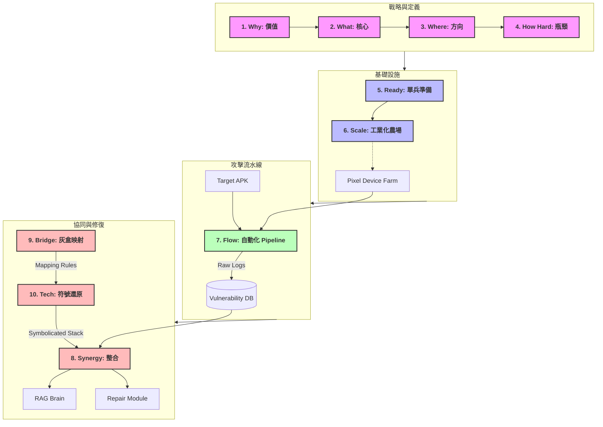

# Android Automated Penetration Testing: The Master Architecture

這份文檔是整個 **Android 自動化滲透測試體系** 的總覽地圖。

我們從戰略價值出發，深入到底層技術，最終構建了一個融合「攻擊（Red Team）」與「修復（Blue Team）」的完整閉環生態。

---

## 🗺️ 全景架構圖 (The Big Picture)

這張圖展示了 10 份文件如何組合成一個有機運轉的系統：

---

## 📚 文檔索引 (The Index)

### 🟢 Phase 1: 戰略與認知 (Strategy)
*   **[1. why - benefits.md](1.%20why%20-%20benefits.md)**: 為什麼要做？（省錢、合規、商譽）
*   **[2. what - core.md](2.%20what%20-%20core.md)**: 做什麼？（四大檢測維度、驗收標準）
*   **[3. where - direction.md](3.%20where%20-%20direction.md)**: 技術方向？（DBI, Fuzzing, Taint Analysis）
*   **[4. how hard - bottleneck.md](4.%20how%20hard%20-%20bottleneck.md)**: 工程瓶頸？（碎片化、對抗、語義鴻溝）

### 🔵 Phase 2: 基礎設施建設 (Infrastructure)
*   **[5. ready - preparation.md](5.%20ready%20-%20preparation.md)**: 單兵裝備（Pixel, Frida, 授權書）
*   **[6. scale - industrialization.md](6.%20scale%20-%20industrialization.md)**: 軍團建設（去電池化農場、定製 ROM）

### 🟡 Phase 3: 自動化流水線 (Pipeline)
*   **[7. flow - pipeline.md](7.%20flow%20-%20pipeline.md)**: 攻擊流程（靜態預處理 -> 決策中樞 -> 動態執行）
*   **[11. gap - refinement.md](11.%20gap%20-%20refinement.md)**: 架構精進（誤報過濾、AI 幻覺檢測）
*   **[12. tech - ai_navigation.md](12.%20tech%20-%20ai_navigation.md)**: AI 導航員（多模態視覺導航）

### 🔴 Phase 4: 協同與閉環 (Synergy)
*   **[8. synergy - integration.md](8.%20synergy%20-%20integration.md)**: 模組協同（滲透 -> RAG -> Repair）
*   **[9. bridge - harmonization.md](9.%20bridge%20-%20harmonization.md)**: 灰盒戰略（解決黑白盒矛盾）
*   **[10. tech - symbolication.md](10.%20tech%20-%20symbolication.md)**: 核心技術（崩潰日誌還原服務）

### 🟣 Phase 5: 架構設計 (Architecture Design)
*   **[13. design - module_architecture.md](13.%20design%20-%20module_architecture.md)**: 內部架構 V1 (微核心 + 插件化)
*   **[14. design - engine_2.0.md](14.%20design%20-%20engine_2.0.md)**: 內部架構 V2 (事件驅動 + AI 導航)
*   **[15. design - engine_3.0.md](15.%20design%20-%20engine_3.0.md)**: 內部架構 V3 (Hybrid A2: 偵察 + 攻擊 + 驗證)

---

### 🍎 全息師結語

這套文檔體系是從**「單點技術」**進化到**「系統架構」**的完整紀錄。

它不僅指導您如何「駭入」一台手機，更指導您如何建立一個**「具備自我修復能力的資安防禦體系」**。現在，您可以將此目錄作為團隊的 onboard 教材，或產品開發的規格總表。
