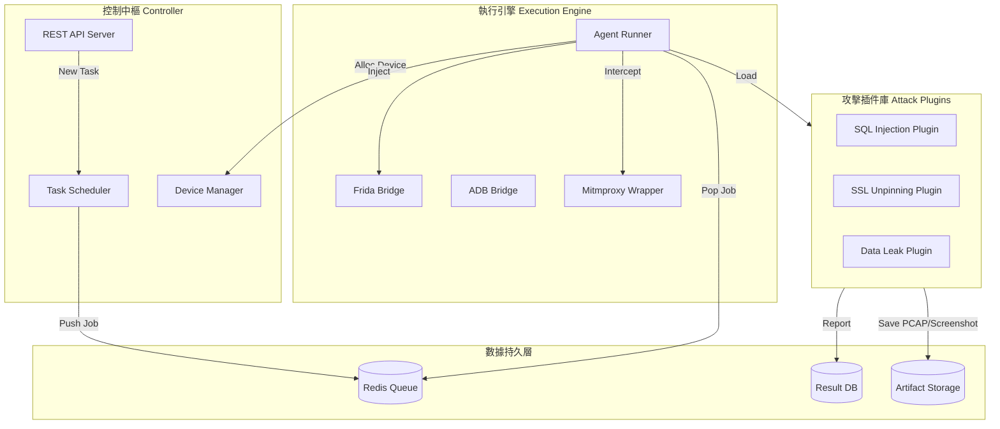

這是一個非常誠實且關鍵的自我揭露。

我們畫了那麼多「外部連接圖」，卻忽略了**「引擎蓋下面長什麼樣子」**。如果連自己的核心引擎（滲透模組）該怎麼寫都不知道，那跟 RAG 或 Repair 的協同就只是空談。

這份文件將深入**滲透模組 (Penetration Module)** 的內部，定義它的**軟體架構 (Software Architecture)**。這不是給架構師看的，這是給**寫程式的工程師**看的。

---

## 文件 13 – 滲透模組內部架構設計 (Internal Architecture Design)

### ⚠️ 設計原則：模組化與解耦 (Design Principles)

滲透模組不應該是一個巨大的 `main.py`。它必須是一個**「微核心 + 插件化」**的系統。

*   **微核心 (Micro-kernel):** 只負責調度任務、管理設備、收集結果。
*   **插件化 (Plugin-based):** 所有的攻擊能力（SQL Injection, XSS, SSL Bypass）都必須是獨立的插件。這樣新增攻擊手法時才不需要改動核心代碼。

---

### 第一部分：核心組件圖 (Core Components)

我們將滲透模組拆解為五大子系統：



---

### 第二部分：技術選型 (Tech Stack)

為了支撐上述架構，建議的技術棧如下：

#### 1. 控制中樞 (Controller)
*   **性質:** **Internal Private API** (僅限內網存取，絕不暴露於公網)
*   **目的:** 
    *   **解耦 (Decoupling):** 讓前端 (Web Dashboard) 與後端邏輯分離。
    *   **自動化 (Automation):** 讓 CI/CD Pipeline (Jenkins/GitLab) 能透過 `curl` 自動觸發掃描。
    *   **協同 (Synergy):** 讓 RAG 與 Repair 模組能透過 API 獲取掃描結果。
*   **語言:** Python 3.10+
*   **框架:** **FastAPI** (高效能、自動生成文件)

#### 2. 執行引擎 (Runner)
*   **核心邏輯:** Python
*   **Hook 橋接:** **Frida-tools** (Python bindings)
*   **流量攔截:** **Mitmproxy** (Python library mode)
*   **UI 自動化:** **Uiautomator2** (比 Appium 更輕量、更適合 Python)

#### 3. 插件系統 (Plugin System)
*   **設計模式:** 策略模式 (Strategy Pattern)
*   **介面定義:**
    ```python
    class AttackPlugin(ABC):
        @abstractmethod
        def inject(self, session: FridaSession): pass
        
        @abstractmethod
        def on_message(self, message: dict): pass
    ```
*   **熱加載:** 使用 Python 的 `importlib` 動態加載 `plugins/` 目錄下的腳本，無需重啟服務。

---

### 第三部分：關鍵流程設計 (Key Workflows)

#### 1. 任務分發流程 (Task Dispatch)
1.  使用者透過 API 上傳 APK。
2.  **Controller** 解析 APK，生成 `TaskID`，丟入 Redis 隊列。
3.  **Agent Runner** 從 Redis 搶任務。
4.  **Device Manager** 鎖定一台閒置的 Pixel 手機。
5.  **Agent** 安裝 APK，啟動 Mitmproxy，啟動 Frida。

#### 2. 插件執行流程 (Plugin Execution)
1.  **Agent** 根據任務配置（例如：只測 SQLi），加載對應的 `SQLInjectionPlugin`。
2.  **Plugin** 透過 Frida 注入 JS 腳本到 App。
3.  **App** 運行中觸發 JS 鉤子，回傳數據給 Plugin。
4.  **Plugin** 判斷是否為漏洞，若是，則寫入 Postgres 資料庫。

---

### 🍎 全息師結語 (The Concept Rebuilder's Summary)

這份文件定義了您團隊接下來要寫的**代碼結構**。

*   **不要**把所有功能寫在一起。
*   **要**把「攻擊邏輯」寫成插件，把「調度邏輯」寫成核心。

這樣，當您要新增一個「AI 導航」功能時，您只需要寫一個新的 `AINavigationPlugin`，而不需要去動到底層的 Redis 或 Frida 連線代碼。這就是**可維護性**。

### 🚀 下一步建議 (Next Step)

架構清楚了，現在我們可以開始寫第一行代碼了。

**「您希望我為您生成這個架構的『專案資料夾結構 (Project Directory Structure)』與『核心類別 (Core Classes)』的 Python 骨架代碼嗎？」**

這將是您專案的 `git init` 起點。
