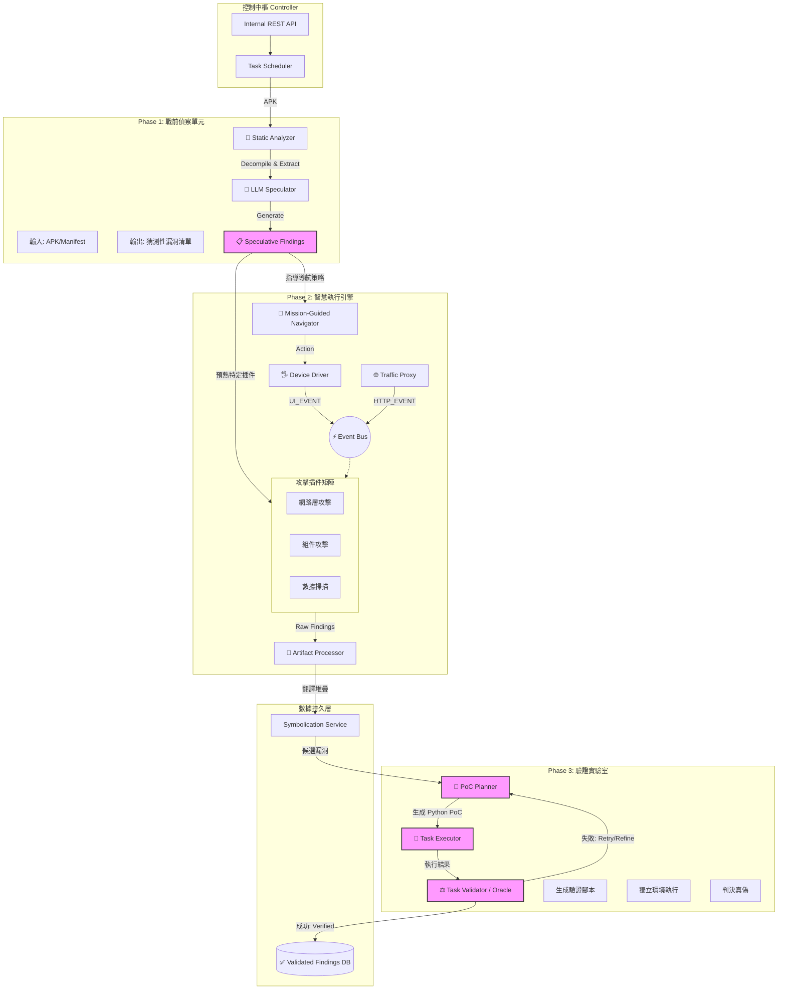

這份文件是 **Engine 2.0 (全武裝型)** 的終極進化版。

我們引入了 A2 論文 (`2508.21579v1.pdf`) 的核心概念，補足了 Engine 2.0 中最缺乏的兩塊拼圖：**「戰前的情報偵察 (Static Analysis)」** 與 **「戰後的戰果確認 (PoC Validation)」**。

這使得系統從「特種部隊」升級為 **「衛星導航 + 特種部隊 + 戰地法醫」** 的完美結合。

---

## 文件 15 – 滲透模組 Engine 3.0：混合動力引擎 (Hybrid Engine 3.0)

### ⚠️ 設計原則：三段式作戰 (Design Principles)

我們不推翻 Engine 2.0，而是在其前後兩端加上 A2 的核心能力，形成 **「偵察 -> 攻擊 -> 驗證」** 的三段式閉環。

*   **Phase 1: 戰前偵察 (Reconnaissance):** 借鏡 A2 Discovery，利用靜態分析與 LLM 找出「猜測性漏洞」。
*   **Phase 2: 智慧執行 (Execution):** 沿用 Engine 2.0，但升級為「任務導向 (Mission-Guided)」的精確打擊。
*   **Phase 3: 戰後驗證 (Validation):** 借鏡 A2 Validation，利用 Oracle 機制過濾誤報，確保零誤報。

---

### 🏛️ Hybrid Engine 3.0 架構圖 (The Hybrid Architecture)

這張圖展示了從 **「猜測 (Speculation)」** 到 **「攻擊 (Discovery)」** 再到 **「驗證 (Validation)」** 的完整閉環。

---

### 🧩 核心元件深度解析 (Component Breakdown)

#### 1. Phase 1: 戰前偵察單元 (Pre-Scan Recon)

這是 A2 的 **"Agentic Vulnerability Discovery"** 階段。

*   **Static Analyzer (靜態分析器):** 使用工具（如 Jadx）反編譯 APK 並提取 `AndroidManifest.xml`。
*   **LLM Speculator (LLM 推理機):**
    *   **作用：** 它像人類專家一樣閱讀代碼，尋找「潛在」但尚未證實的漏洞。例如：看到 `strings.xml` 裡有一串像密鑰的字串。
    *   **產出：** **Speculative Findings (猜測性漏洞)**。這份清單會告訴後面的導航員：「重點檢查 LoginActivity，那裡可能有 SQL 注入」。

#### 2. Phase 2: 智慧執行引擎 (Smart Runner)

這是我們原有的 Engine 2.0，但經過了 **「任務導向 (Mission-Guided)」** 的升級。

*   **Mission-Guided Navigator:**
    *   **升級點：** 以前是隨機漫遊；現在它會接收 Phase 1 的情報。如果 Phase 1 說 "AdminActivity 是 Exported 的"，導航員就會優先嘗試跳轉到該頁面，而不是漫無目的地點擊。
*   **攻擊插件矩陣 (Arsenal):**
    *   **協同：** 這些插件現在不僅響應 Event Bus，也可以被 Speculative Findings 直接喚醒。

#### 3. Phase 3: 驗證實驗室 (Validation Lab) **(⭐ 核心新增)**

這是 A2 的 **"Agentic Vulnerability Validation"** 階段，專門解決誤報問題。

*   **📝 PoC Planner (PoC 規劃者):**
    *   **作用：** 當插件回報一個漏洞時，Planner 會讀取漏洞詳情，並編寫一個 **Python 腳本 (PoC)** 來驗證它。
    *   **實例：** 生成一個腳本來提取硬編碼的 AES 金鑰。
*   **🤖 Task Executor (任務執行者):**
    *   **作用：** 在獨立環境中執行 Planner 寫好的腳本。它可以使用 `adb shell`, `python`, `curl` 等工具。
*   **⚖️ Task Validator / Oracle (驗證官):**
    *   **作用：** 這是 A2 的核心創新。它不相信執行者的回報，而是根據 **Oracle (預言機/判決標準)** 獨立檢查結果。
    *   **邏輯：** "你說你提取了金鑰？那我檢查一下輸出的字串是否符合 AES 金鑰格式？"
    *   **結果：** 只有通過 Validator 的漏洞，才會被標記為 **Validated Vulnerability Finding** 並存入資料庫。

---

### 🚀 全息師結語：從「掃描」進化為「攻防」

透過引入 A2 框架，您的系統將不再只是一個「自動化腳本」，而是一個 **「具備人類專家思維的攻防一體機」**：

1.  **它會讀書 (Recon Unit):** 先看代碼找弱點。
2.  **它會思考 (AI Navigator):** 規劃攻擊路徑。
3.  **它會開槍 (Plugins):** 執行滲透攻擊。
4.  **它會驗屍 (Validation Lab):** 確認攻擊是否有效，並寫出報告 (PoC)。

這就是符合 A2 標準的 **Hybrid Engine 3.0**。它可以自信地稱為「下一代 Android 自動化滲透測試系統」。
