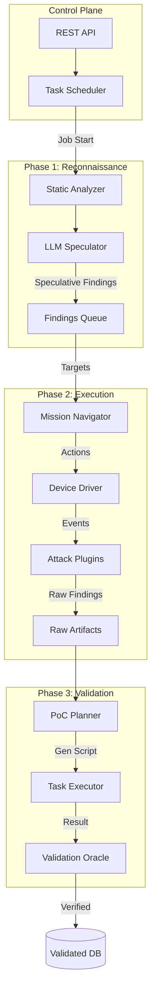

# System Architecture: Engine 3.0

## Overview

The **Engine 3.0 (Hybrid Engine)** represents the current state-of-the-art architecture for the automated pentest framework. It integrates the findings from the **Agentic Android Analysis (A2)** research (`2508.21579v1.pdf`), creating a closed-loop system that combines reconnaissance, execution, and validation.

The architecture shifts from a linear execution model to a **Mission-Guided** approach, ensuring that every action is informed by prior intelligence and every finding is rigorous verified.

---

## Architectural Principles

1.  **Reconnaissance-First**: No blind firing. Attack execution is guided by initial static analysis and LLM-driven speculation.
2.  **Mission-Guided Navigation**: UI exploration is not random but directed towards specific high-value targets identified during reconnaissance.
3.  **Zero-False-Positive Validation**: All findings must be verified by an independent "Oracle" mechanism before reporting.

---

## Core Components

### Phase 1: Reconnaissance Unit (Pre-Scan)
*Corresponds to A2 Discovery Phase*

*   **Static Analyzer**: utilizes tools like `Jadx` to decompile the APK and extract the `AndroidManifest.xml` and source code.
*   **LLM Speculator**: A Large Language Model processes the decompiled code to identify **Speculative Findings**.
    *   *Example*: "The file `LoginActivity.java` contains a string pattern resembling a hardcoded key."
    *   *Output*: A list of potential targets and hypotheses to guide the dynamic engine.

### Phase 2: Execution Engine (Smart Runner)
*The core dynamic interaction layer*

*   **Mission-Guided Navigator**: Receives valid targets from Phase 1. Instead of random traversal, it specifically navigates to relevant Activities (e.g., `ExportedActivity`) to test the hypotheses.
*   **Arsenal (Plugin Matrix)**: A collection of attack modules (Network, Component, Data) that can be triggered deeply within the app's workflow.
    *   *Event Bus*: Attack modules subscribe to UI and Network events, triggering automatically when specific conditions are met (e.g., triggering a SQL Injection test when a login form is detected).

### Phase 3: Validation Lab (Post-Scan)
*Corresponds to A2 Validation Phase*

*   **PoC Planner**: Analyzes reported vulnerabilities and generates a Python-based **Proof of Concept (PoC)** script to reproduce steps.
*   **Task Executor**: Runs the generated PoC in a clean, isolated environment to attempt reproduction.
*   **Validator (Oracle)**: Independently verifies the success of the PoC execution.
    *   *Logic*: "Does the output of the script match the expected vulnerability signature (e.g., correct AES key format)?"
    *   *Result*: Only findings that pass this check are committed to the **Validated Findings Database**.

---

## Data Flow Diagram

## Evolution Context

*   **Engine 1.0**: Basic script-based execution. Linear and fragile.
*   **Engine 2.0**: Introduced the Event Bus and decoupled plugins, allowing for asynchronous attacks. Lacked verification.
*   **Engine 3.0 (Current)**: Adds the A2-inspired Recon and Validation loops, significantly reducing false positives and improving navigation efficiency.
