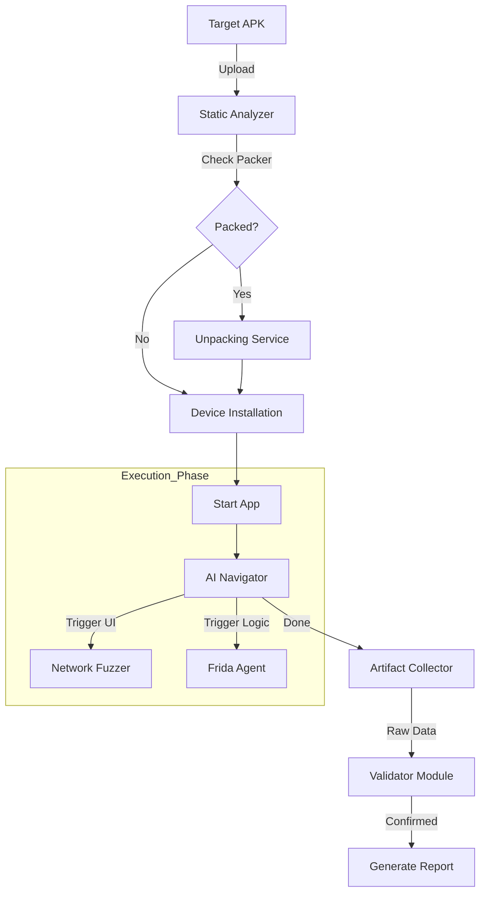

# Operations Pipeline

## Overview

The operational pipeline follows a strict "Input -> Decision -> Execution -> Output" model. This ensures that every submitted APK undergoes a consistent and rigorous assessment process.

## Pipeline Stages

### Stage 1: Ingestion & Pre-flight
**Goal**: Quick assessment of the target application surface and defenses.

1.  **APK Manifest Parsing**:
    Extracts `AndroidManifest.xml` to identify:
    -   **Entry Points**: `MAIN` and `LAUNCHER` activities.
    -   **Attack Surface**: Activities, Services, and Providers marked with `exported="true"`.
    -   **Permissions**: Requested capabilities (e.g., `READ_SMS`, `INTERNET`).

2.  **Packer Detection**:
    Analyzes the APK for signatures of commercial packers (e.g., Tencent, Jiagu).
    -   *Decision Point*: If a packer is detected, the pipeline routes the APK to the **Unpacking Station** or loads specific **Anti-Anti-Debugging** scripts (e.g., Frida scripts to hide root).

### Stage 2: Dynamic Execution (The Engine)
**Goal**: Execute comprehensive attacks in a controlled environment.

Upon successful installation on the device farm, three parallel engines are engaged:

1.  **AI Navigator (UI Crawler)**:
    -   Traverses the application UI to maintain active sessions.
    -   Handles login flows, CAPTCHAs (via external solving services), and navigation to deep links.
    
2.  **Traffic Interceptor (Proxy)**:
    -   Captures all HTTP/S and WebSocket traffic.
    -   **Active Fuzzing**: Replays requests with malicious payloads (SQLi, XSS, Command Injection) targeting the backend APIs.

3.  **Runtime Hooker (Instrumentation)**:
    -   Injects agents into the application process.
    -   **Sensitive Data Monitoring**: alerting when data is written to the clipboard, logs, or external storage.
    -   **Encryption Breaking**: Hooking `javax.crypto` to capture keys and cleartext payloads.

### Stage 3: Post-Processing & Validation
**Goal**: Convert raw logs into actionable intelligence.

1.  **Artifact Collection**:
    -   Aggregates Logcat, Network artifacts (.saz/.har), and Screenshots.

2.  **De-duplication**:
    -   Groups similar crash logs or findings (e.g., 50 crashes caused by the same NullPointerException count as 1 finding).

3.  **Trace Symbolication**:
    -   Maps obfuscated stack traces (e.g., `a.b.c()`) back to source code locations (e.g., `AuthManager.login():42`) using the artifacts from the static analysis phase.

### Stage 4: Reporting
**Goal**: Generation of compliance-ready documents.

-   **Output Format**: detailed JSON/SARIF for machine consumption (CI/CD integration) and PDF/HTML for human review.
-   **Evidence**: Every finding includes a "Proof of Concept" (PoC), such as a replayable curl command or a Python script that reproduces the vulnerability.

---

## Workflow Diagram

