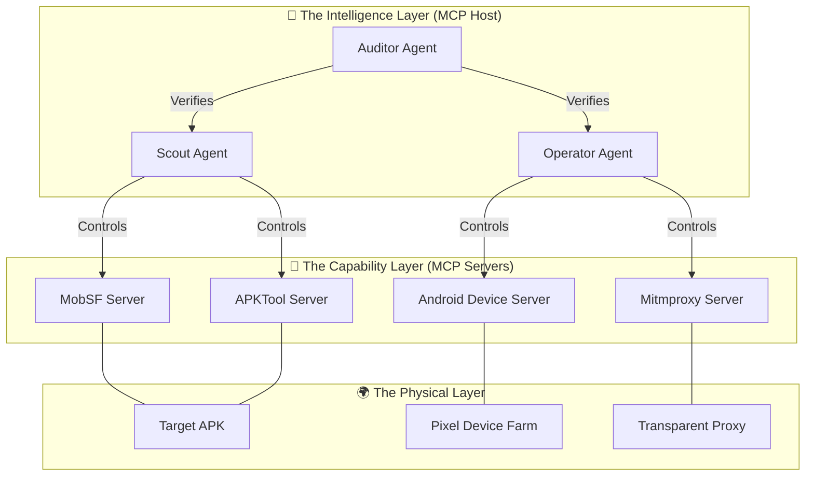

# The Intelligent Architecture: Hybrid Engine 3.0

## 1. System Philosophy: AI-Native Cyber-Physical System

This document defines the architecture of the **Hybrid Engine 3.0**, a system where Artificial Intelligence is not an "add-on" feature, but the **Kernel** of the operation.

Unlike traditional scanners that blindly iterate through checklists, this system operates as an **Intelligent Agent** that perceives, reasons, acts, and verifies. It treats the entire penetration testing environment—from the Static Analyzers to the Physical Device Farm—as a set of tools orchestrated by a central brain via the **Model Context Protocol (MCP)**.

---

## 2. The Trinity Architecture

The system is composed of three distinct layers, each governed by a specialized AI Agent role.



### 2.1 The Intelligence Layer (The Brain)
This is the runtime of the Large Language Model (LLM). It does not just "generate text"; it holds the **State** of the penetration test.

*   **The Scout Agent**: Responsible for **Understanding**. It reads the Manifest, decompiles code, and builds a "Mental Model" of the app's attack surface. It asks: *"Where are the weak points?"*
*   **The Operator Agent**: Responsible for **Action**. It controls the physical devices and network proxies. It executes attacks based on the Scout's findings. It asks: *"How do I exploit this?"*
*   **The Auditor Agent**: Responsible for **Truth**. It rejects hallucinations. When the Operator claims "Vulnerability Found", the Auditor demands a reproducible Proof of Concept (PoC). It asks: *"Can you prove it?"*

### 2.2 The Capability Layer (The Body)
These are the **MCP Servers**. They have no intelligence; they are deterministic tool wrappers that expose JSON interfaces to the Brain.

*   **MobSF MCP**: Exposes high-level scanning capabilities (e.g., `scan_file`, `get_permissions`).
*   **APKTool MCP**: Exposes low-level binary manipulation (e.g., `decode`, `search_smali`, `patch_smali`, `build`).
*   **Android Device MCP**: Exposes physical control (e.g., `adb_tap`, `adb_shell`, `get_logcat`).
*   **Mitmproxy MCP**: Exposes network control (e.g., `intercept_request`, `inject_payload`, `get_traffic_history`).

### 2.3 The Physical Layer (The World)
The tangible infrastructure where the software lives.
*   **Pixel Device Farm**: The physical android devices running the target apps.
*   **Transparent Proxy**: The network gateway capturing all traffic.

---

## 3. Core Mechanisms

### 3.1 The Nervous System: Model Context Protocol (MCP)
Communication between the Brain and the Body happens exclusively via MCP. This standardizes all tools into a format the LLM natively understands.

**Example: The tool definition for "Installing an App"**
```json
{
  "name": "install_and_launch",
  "description": "Installs an APK to the device and launches its main activity.",
  "parameters": {
    "type": "object",
    "properties": {
      "apk_path": { "type": "string" },
      "grant_permissions": { "type": "boolean", "description": "If true, grants all runtime permissions." }
    },
    "required": ["apk_path"]
  }
}
```
*The AI Agent calls this function, and the MCP Server translates it into `adb install -g ...`.*

### 3.2 The Decision Loop: OODA
The system operates on the **Observe-Orient-Decide-Act (OODA)** loop, distinct from linear CI/CD pipelines.

1.  **Observe**: The Scout Agent scans the APK Manifest.
2.  **Orient**: The Agent recognizes "This app uses a custom URL scheme `myapp://reset_password`".
3.  **Decide**: The Agent formulates a hypothesis: "If I trigger this scheme without a token, I might bypass authentication."
4.  **Act**: The Operator Agent instructs the Device Server: `am start -d "myapp://reset_password"`.

### 3.3 State Management: The Context Window
Unlike a stateless script, the System maintains a continuous **Context**.
*   **Evidence Chain**: Every successful step (e.g., a crash log, a successful HTTP interception) is stored in the Agent's context window.
*   **Hypothesis Log**: Failed attacks are recorded to prevent the Agent from trying the same failed strategy twice (Self-Correction).

---

## 4. Evolution from Legacy Systems

| Feature             | Legacy Scanners (e.g., MobSF/QARK)           | Intelligent Architecture (Engine 3.0)                                                          |
| :------------------ | :------------------------------------------- | :--------------------------------------------------------------------------------------------- |
| **Logic**           | **Linear**: Step 1 -> Step 2 -> Step 3       | **Adaptive**: Step 1 -> Result Analysis -> Decide next step                                    |
| **Context**         | **Stateless**: Each check is independent.    | **Stateful**: Later attacks depend on earlier findings.                                        |
| **Handling Errors** | **Fragile**: If login fails, the scan stops. | **Resilient**: If login fails, Agent reads the error message and tries a different credential. |
| **Validation**      | **None**: Reports 100 potential issues.      | **Rigorous**: Auditor Agent verifies issues; reports only 5 confirmed bugs.                    |

---

## 5. Technical Specifications

### Agent Runtime Environment
*   **Host**: Python 3.10+ running an Orchestrator (e.g., LangChain / AutoGen customized for MCP).
*   **Context Limit**: Minimum 128k context window requried (e.g., Gemini 1.5 Pro, Claude 3.5 Sonnet) to hold Analysis + Smali Snippets.

### MCP Server Specifications
*   **Transport**: Stdio (Standard Input/Output) for local speed and security.
*   **Isolation**: Each MCP Server runs in its own Docker container or venv to prevent dependency conflicts (e.g., Java 11 for MobSF vs Java 17 for Build tools).

This architecture transforms the penetration test from a "Script Execution" task into a "Problem Solving" task managed by Artificial Intelligence.
