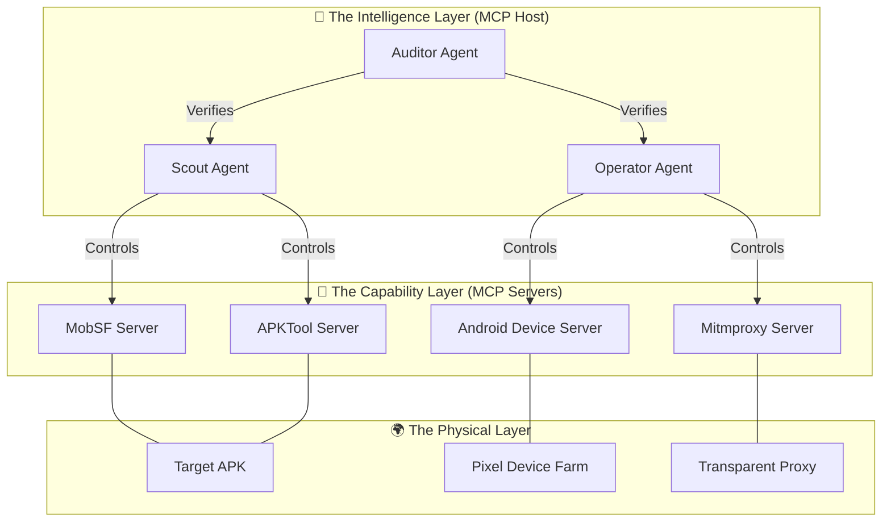

# The Intelligent Architecture: Hybrid Engine 3.0

## 1. System Philosophy: AI-Native Cyber-Physical System

This document defines the architecture of the **Hybrid Engine 3.0**, a system where Artificial Intelligence is not an "add-on" feature, but the **Kernel** of the operation.

Unlike traditional scanners that blindly iterate through checklists, this system operates as an **Intelligent Agent** that perceives, reasons, acts, and verifies. It treats the entire penetration testing environment—from the Static Analyzers to the Physical Device Farm—as a set of tools orchestrated by a central brain via the **Model Context Protocol (MCP)**.

---

## 2. The Trinity Architecture

The system is composed of three distinct layers, each governed by a specialized AI Agent role.



### 2.1 The Intelligence Layer (The Brain)
This is the runtime of the Large Language Model (LLM). It does not just "generate text"; it holds the **State** of the penetration test.

*   **The Scout Agent**: Responsible for **Understanding**. It reads the Manifest, decompiles code, and builds a "Mental Model" of the app's attack surface. It asks: *"Where are the weak points?"*
*   **The Operator Agent**: Responsible for **Action**. It controls the physical devices and network proxies. It executes attacks based on the Scout's findings. It asks: *"How do I exploit this?"*
*   **The Auditor Agent**: Responsible for **Truth**. It rejects hallucinations. When the Operator claims "Vulnerability Found", the Auditor demands a reproducible Proof of Concept (PoC). It asks: *"Can you prove it?"*

### 2.2 The Capability Layer (The Body)
These are the **MCP Servers**. They have no intelligence; they are deterministic tool wrappers that expose JSON interfaces to the Brain.

*   **MobSF MCP**: Exposes high-level scanning capabilities (e.g., `scan_file`, `get_permissions`).
*   **APKTool MCP**: Exposes low-level binary manipulation (e.g., `decode`, `search_smali`, `patch_smali`, `build`).
*   **Android Device MCP**: Exposes physical control (e.g., `adb_tap`, `adb_shell`, `get_logcat`).
*   **Mitmproxy MCP**: Exposes network control (e.g., `intercept_request`, `inject_payload`, `get_traffic_history`).

### 2.3 The Physical Layer (The World)
The tangible infrastructure where the software lives.
*   **Pixel Device Farm**: The physical android devices running the target apps.
*   **Transparent Proxy**: The network gateway capturing all traffic.

---

## 3. Core Mechanisms

### 3.1 The Nervous System: Model Context Protocol (MCP)
Communication between the Brain and the Body happens exclusively via MCP. This standardizes all tools into a format the LLM natively understands.

**Example: The tool definition for "Installing an App"**
```json
{
  "name": "install_and_launch",
  "description": "Installs an APK to the device and launches its main activity.",
  "parameters": {
    "type": "object",
    "properties": {
      "apk_path": { "type": "string" },
      "grant_permissions": { "type": "boolean", "description": "If true, grants all runtime permissions." }
    },
    "required": ["apk_path"]
  }
}
```
*The AI Agent calls this function, and the MCP Server translates it into `adb install -g ...`.*

### 3.2 The Decision Loop: OODA
The system operates on the **Observe-Orient-Decide-Act (OODA)** loop, distinct from linear CI/CD pipelines.

1.  **Observe**: The Scout Agent scans the APK Manifest.
2.  **Orient**: The Agent recognizes "This app uses a custom URL scheme `myapp://reset_password`".
3.  **Decide**: The Agent formulates a hypothesis: "If I trigger this scheme without a token, I might bypass authentication."
4.  **Act**: The Operator Agent instructs the Device Server: `am start -d "myapp://reset_password"`.

### 3.3 State Management: The Context Window
Unlike a stateless script, the System maintains a continuous **Context**.
*   **Evidence Chain**: Every successful step (e.g., a crash log, a successful HTTP interception) is stored in the Agent's context window.
*   **Hypothesis Log**: Failed attacks are recorded to prevent the Agent from trying the same failed strategy twice (Self-Correction).

---

## 4. Evolution from Legacy Systems

| Feature             | Legacy Scanners (e.g., MobSF/QARK)           | Intelligent Architecture (Engine 3.0)                                                          |
| :------------------ | :------------------------------------------- | :--------------------------------------------------------------------------------------------- |
| **Logic**           | **Linear**: Step 1 -> Step 2 -> Step 3       | **Adaptive**: Step 1 -> Result Analysis -> Decide next step                                    |
| **Context**         | **Stateless**: Each check is independent.    | **Stateful**: Later attacks depend on earlier findings.                                        |
| **Handling Errors** | **Fragile**: If login fails, the scan stops. | **Resilient**: If login fails, Agent reads the error message and tries a different credential. |
| **Validation**      | **None**: Reports 100 potential issues.      | **Rigorous**: Auditor Agent verifies issues; reports only 5 confirmed bugs.                    |

---

## 5. Technical Specifications

### Agent Runtime Environment
*   **Host**: Python 3.10+ running an Orchestrator (e.g., LangChain / AutoGen customized for MCP).
*   **Context Limit**: Minimum 128k context window requried (e.g., Gemini 1.5 Pro, Claude 3.5 Sonnet) to hold Analysis + Smali Snippets.

### MCP Server Specifications
*   **Transport**: Stdio (Standard Input/Output) for local speed and security.
*   **Isolation**: Each MCP Server runs in its own Docker container or venv to prevent dependency conflicts (e.g., Java 11 for MobSF vs Java 17 for Build tools).

This architecture transforms the penetration test from a "Script Execution" task into a "Problem Solving" task managed by Artificial Intelligence.
# The Attack Lifecycle: Operational Workflow

## 1. Overview: The Concrete Process

This document describes the exact **Logical Flow** of an automated penetration test within the Engine 3.0 architecture. It details the step-by-step decision-making process executed by the AI Agents, moving from a raw APK to a verified vulnerability report.

The workflow is divided into four distinct phases:
1.  **Ingestion & State Profiling** (The Setup)
2.  **Strategic Reconnaissance** (The Map)
3.  **Dynamic Execution & Adaptation** (The Offense)
4.  **Verification & Reporting** (The Proof)

---

## Phase 1: Ingestion & State Profiling
*Objective: Prepare the environment and understand the target's defenses.*

### Step 1.1: The "Pre-Flight" Check
**Agent**: Scout Agent
**Action**:
1.  Receives `target.apk`.
2.  Calls `APKTool MCP` -> `get_manifest`.
3.  **Decision Gate: Packer Detection**
    *   *Logic*: The Agent checks for known packer signatures (e.g., `com.tencent.StubShell`, `libjiagu.so`).
    *   **Branch A (Packed)**: Agent triggers `Unpacker Workflow`. It installs the APK on a "Sacrificial Device" running a memory-dumping tool (e.g., Frida-DexDump) to extract the DEX file.
    *   **Branch B (Clean)**: Agent proceeds to standard analysis.

### Step 1.2: Environment Hardening
**Agent**: Operator Agent
**Action**:
1.  Based on Phase 1.1, the Agent configures the **Device Farm**.
2.  **Anti-Anti-Debug Strategy**:
    *   If the App uses aggressive Root Detection (detected via strings in Step 1.1), the Agent enables **"Stealth Mode"** (Zygisk + Shamiko + KernelSU).
    *   If the App requires VPN/Geo-matching, the Agent configures the `Transparent Proxy` to route traffic through the appropriate exit node.

---

## Phase 2: Strategic Reconnaissance
*Objective: Build an Attack Graph. Don't just scan; plan.*

### Step 2.1: Surface Mapping
**Agent**: Scout Agent
**Action**:
1.  **Static Analysis**: Calls `MobSF MCP` to list all specific entry points:
    *   Exported Activities (UI Pages accessible from outside).
    *   Deep Link Schemes (e.g., `myapp://`).
    *   Broadcast Receivers.
2.  **Credential Hunting**: Calls `APKTool MCP` -> `search_in_file` seeking regex patterns for API Keys, Bearer Tokens, or Test Credentials.

### Step 2.2: The Attack Graph Generation
**Agent**: Scout Agent
**Action**:
1.  The Agent synthesizes the findings into a **DAG (Directed Acyclic Graph)** of potential attacks.
    *   *Node 1*: "LoginActivity is exported." -> *Edge*: "Try bypassing auth".
    *   *Node 2*: "Deep Link `myapp://admin` exists." -> *Edge*: "Try SQL Injection on parameters".
    *   *Node 3*: "Hardcoded AWS Key found." -> *Edge*: "Try enumerating S3 buckets".

---

## Phase 3: Dynamic Execution & Adaptation
*Objective: Execute the Attack Graph. Manage state and errors.*

### Step 3.1: The Navigation Loop
**Agent**: Operator Agent
**Action**:
1.  Target: **LoginActivity**.
2.  **Challenge**: The Login Page appears.
3.  **Adaptive Logic**:
    *   *Attempt 1*: Try standard test credentials (`admin` / `123456`).
    *   *Result*: "Login Failed".
    *   *Attempt 2*: Try to register a new user.
    *   *Result*: "Captcha Required".
    *   *Attempt 3 (The Bypass)*: The Scout Agent notices a "Demo Mode" flag in the code. The Operator triggers the app with intent extra `am start ... --ez demo_mode true`.
    *   *Result*: **"Main Activity Accessed"**. (Success)

### Step 3.2: The Attack Injection
**Agent**: Operator Agent
**Action**:
1.  Once inside the app, the Agent monitors the **Mitmproxy** traffic.
2.  It detects an API call: `POST /api/v1/transfer_money`.
3.  **Fuzzing Logic**:
    *   Instead of random garbage, the Agent constructs **Context-Aware Payloads**.
    *   It sees `amount: 100`. It modifies it to `amount: -100` (Negative Logic).
    *   It sees `to_user: 123`. It modifies it to `to_user: ' OR 1=1 --` (SQLi).

### Step 3.3: Error Handling (Self-Healing)
**Agent**: Operator Agent
**Action**:
1.  The App crashes during Fuzzing.
2.  **Crash Recovery**:
    *   The Agent detects the `Process Death` event via ADB.
    *   It captures the `logcat` stack trace.
    *   It **Restarts** the app and navigates back to the previous state to continue the next test case. *It does not stop.*

---

## Phase 4: Verification & Reporting
*Objective: Filter noise. Prove findings.*

### Step 4.1: The "Auditor" Verification
**Agent**: Auditor Agent
**Action**:
1.  The Operator claims: "I found a SQL Injection in the Search Bar."
2.  The Auditor demands a PoC.
3.  **Reproduction**:
    *   The Auditor spins up a **Clean Device** (Factory Reset state).
    *   It executes the *exact* replay script provided by the Operator.
4.  **Judgment**:
    *   If the DB error appears in the response -> **VERIFIED**.
    *   If the App just shows "No Results" -> **FALSE POSITIVE** (Discarded).

### Step 4.2: Remediation Generation
**Agent**: Auditor Agent
**Action**:
1.  For verified vulnerabilities, the Agent queries its Knowledge Base (CWE/OWASP).
2.  It identifies the exact line of code (mapped via Symbolication).
3.  It outputs a specific code patch (e.g., "Use `PreparedStatement` instead of String concatenation at `LoginActivity.java:45`").

---

## Summary of the Flow

| Phase          | State     | Key Decision                        |
| :------------- | :-------- | :---------------------------------- |
| **1. Ingest**  | Detecting | "Is this app packed/hardened?"      |
| **2. Recon**   | Planning  | "What are the high-value targets?"  |
| **3. Execute** | Attacking | "How do I bypass this login/check?" |
| **4. Verify**  | Judging   | "Is this real or just a glitch?"    |

This workflows transforms the penetration test from a linear script into a **dynamic conversation** between the Agent and the Application.
# The Infrastructure Foundation

## 1. Overview: The Physical Reality

The **Intelligent Architecture** and **Attack Lifecycle** are entirely dependent on a stable, robust physical foundation. If the device farm is unstable or the network proxy leaks, the AI Agents will fail.

This document serves as the **Engineering Spec** for the physical and operating system layers of the framework.

---

## 2. Device Farm Engineering

### 2.1 The "Battery-less" Modification
**Problem**: Continuous charging cycles and high CPU load (Fuzzing) cause Li-ion batteries to swell, creating a fire hazard and physical destruction of the server rack.
**Solution**: Converting devices to direct DC power.

*   **Component**: **Buck Converter (DC-DC Step-Down)**.
    *   *Input*: 5V (USB Bus).
    *   *Output*: 3.8V - 4.2V (simulating battery voltage).
*   **Implementation**:
    1.  Disassemble the Pixel device.
    2.  Remove the physical battery and the BMS (Battery Management System) board.
    3.  Solder the Buck Converter output to the battery connector points on the motherboard.
    4.  **Critical Step**: Some kernels verify battery temperature. A **10kΩ Resistor** must be soldered between the NTC (Temp) pin and Ground to simulate a constant "25°C" temperature, preventing the OS from shutting down due to "Thermal Runaway" (missing sensor).

### 2.2 USB Scalability & Bandwidth
**Problem**: Connecting 20+ devices creates USB bandwidth congestion and ARP storms.
**Solution**: Isolated Hub & Network Topology.

*   **Hardware**: Industrial USB Hubs (e.g., Acasis 16-port) with separate power supply (12V/10A+).
*   **Data Layout**:
    *   Use **USB 3.0** for the Host connection to handle high-bandwidth ADB Screencast streams.
    *   Devices are logically separated using `udev` rules on the Linux Host to assign persistent symlinks (e.g., `/dev/android_01`, `/dev/android_02`) based on Serial Number.

---

## 3. The Transparent Operating System (Custom ROM)

Store-bought phones are "noisy" and "locked". We require a custom AOSP (Android Open Source Project) build to provide absolute control and invisibility.

### 3.1 Hiding Root (Kernel-Level Stealth)
**Problem**: Apps use `Runtime.exec("su")` or check for `/system/bin/su` to detect Root.
**Solution**: **Systemless Root is not enough.** We use **Source-Modification Root**.

*   **AOSP Patch**:
    *   Modify `system/core/libcutils/fs_config.cpp` to grant `AID_ROOT` capabilities to our specific Agent Package UID.
    *   Rename the `su` binary to a random string (e.g., `magicsocks`).
    *   Modify the Agent's code to call `magicsocks` instead of `su`.
    *   *Result*: Standard Root detection logic (looking for "su") returns `False`, but our Agent has full root access.

### 3.2 Certificate Injection (Network Trust)
**Problem**: Android 7+ ignores User-Installed CA Certificates. Mitmproxy cannot decrypt traffic.
**Solution**: Bake the CA into the System Image.

*   **Implementation**:
    1.  Generate the Mitmproxy CA hash: `openssl x509 -inform PEM -subject_hash_old -in mitmproxy-ca-cert.pem`.
    2.  Rename the cert to `<hash>.0`.
    3.  During AOSP Build: Place the file in `system/core/rootdir/etc/security/cacerts/`.
    4.  *Result*: The device treats our Proxy as a trusted Root Authority (like VeriSign or DigiCert) out of the box. No Magisk module required.

---

## 4. Network Topology & Isolation

### 4.1 Reverse Tethering (The Air-Gap)
**Policy**: Devices MUST NOT use Wi-Fi.
*   **Reason 1 (Stability)**: Wi-Fi is prone to interference in dense racks.
*   **Reason 2 (Security)**: Wi-Fi allows apps to scan the local network (LAN Discovery).
*   **Implementation**:
    *   Enable **Gnirehtet** (Reverse Tethering).
    *   Traffic Flow: `App -> Android Kernel (VPN/Tun) -> USB -> Host PC -> Mitmproxy -> Internet`.
    *   This forces 100% of traffic through our inspection point.

### 4.2 Transparent Proxying
**Configuration**:
The Host machine uses `iptables` to redirect all traffic coming from the USB interface (e.g., `usb0`) to the Mitmproxy listening port.

```bash
# Example Logic (Conceptual)
iptables -t nat -A PREROUTING -i usb+ -p tcp --dport 80 -j REDIRECT --to-port 8080
iptables -t nat -A PREROUTING -i usb+ -p tcp --dport 443 -j REDIRECT --to-port 8080
```

---

## 5. Summary of Specs

| Constraint    | Specification                                      |
| :------------ | :------------------------------------------------- |
| **Power**     | Direct DC (Buck Converter) + NTC Spoofing Resistor |
| **Root**      | Source-modified `su` binary (Renamed)              |
| **Network**   | USB Reverse Tethering + System CA Injection        |
| **Bandwidth** | Dedicated USB 3.0 Controllers per 10 devices       |
| **Recovery**  | OverlayFS snapshotting for instant "Factory Reset" |

This infrastructure ensures that when the AI Agent commands "Run Attack", the physical reality complies instantly, silently, and reliably.
