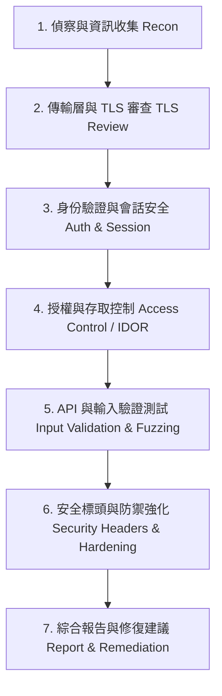

# Web 應用程式安全評估與滲透測試標準工作流程 (Web Security Assessment Workflow)

[Back to Security Topics](README.md)

---

## 🎯 概述

本指南彙整了 Web 應用程式與 API 服務在進行黑箱/灰箱安全評估（Security Assessment & Penetration Testing）時的標準檢測階段、方法論與驗證手法。

---

## 🔄 核心測試階段

---

## 📋 各階段檢查清單與測試方法

### 1. 偵察與資訊收集 (Reconnaissance & Enumeration)
- **目錄與端點探測**：
  - 檢測常見隱藏端點（如 `/robots.txt`、`/sitemap.xml`、`/.well-known/`、`/.git/`、`/actuator`）。
  - 檢測開發者工具與除錯介面（如 `/graphql`、`/swagger`、`/api-docs`、`/debug`）。
- **服務指紋識別**：
  - 檢查 `Server`、`X-Powered-By` 等 Response Headers，確認伺服器與框架版本。
  - 檢測敏感端點資訊洩漏（例如 `/api/v1/info` 或 `/health` 是否回傳內部系統 IP/版本）。

### 2. 傳輸層安全與憑證檢驗 (TLS / SSL Configuration Review)
- **憑證有效性**：檢查憑證是否過期、自簽（Self-signed）、主機名稱是否相符（Hostname Mismatch）。
- **密碼套件與協定**：
  - 禁用不安全的協定（SSLv2, SSLv3, TLS 1.0, TLS 1.1）。
  - 禁用弱加密套件（CBC 模式 ciphers、RC4、DES、NULL 或 RSA+SHA1 簽章演算法）。
  - 確保啟用 Forward Secrecy（ECDHE 系列）。

### 3. 身份驗證與會話安全 (Authentication & Session Security)
- **暴力破解防禦**：
  - 登入端點與密碼重設端點是否具備 Rate Limiting / 驗證碼防護。
- **Cookie 安全屬性**：
  - 確保 Session Cookie 具備 `Secure`、`HttpOnly` 以及 `SameSite=Strict` 或 `SameSite=Lax`。
- **GraphQL / API 未授權存取**：
  - 確認 GraphQL Playground 或 Introspection Query 是否在生產環境中暴露。

### 4. 授權與水平/垂直權限控管 (Authorization & IDOR)
- **不安全的直接物件參照 (IDOR)**：
  - 測試修改 Request 中的 `user_id`、`order_id` 或 `file_id` 是否可未授權檢視他人資料。
- **權限提升 (Privilege Escalation)**：
  - 測試普通使用者身份存取 `/admin` 或管理員專用 API 端點。

### 5. 輸入驗證與常見漏洞 (Input Validation & Injection)
- **跨站腳本攻擊 (XSS)**：測試反射型、儲存型與 DOM-based XSS。
- **跨站請求偽造 (CSRF)**：確認狀態變更操作（POST/PUT/DELETE）是否具備 CSRF Token 或依賴 SameSite Cookie。
- **SQL / NoSQL 注入**：檢測資料庫查詢參數是否正確使用 Parameterized Query。
- **伺服器端請求偽造 (SSRF)**：檢測接受 URL 參數進行遠端抓取的端點。

### 6. HTTP 安全標頭基準檢視 (Security Headers)

| 標頭名稱 (Header) | 建議值範例 | 防範威脅 |
| :--- | :--- | :--- |
| `Content-Security-Policy` | `default-src 'self'; script-src 'self'` | 緩解 XSS 與未授權資源載入 |
| `Strict-Transport-Security` | `max-age=31536000; includeSubDomains` | 強制強制 HTTPS 連線 |
| `X-Frame-Options` | `DENY` 或 `SAMEORIGIN` | 防範 Clickjacking (點擊劫持) |
| `X-Content-Type-Options` | `nosniff` | 防止 MIME-type 混淆攻擊 |
| `Referrer-Policy` | `strict-origin-when-cross-origin` | 避免敏感 URL 洩漏 |
| `Permissions-Policy` | `camera=(), microphone=(), geolocation=()` | 限制瀏覽器功能與感測器存取 |

---

## 🛠️ 推薦檢測工具

- **TLS / SSL 分析**：`testssl.sh`、`sslyze`
- **漏洞掃描與代理**：`OWASP ZAP`、`Burp Suite`
- **連線與端點探測**：[Script-List/automation/url-health-checker](file:///c:/Users/g1014308/Documents/GitHub/Youchen/Script-List/automation/url-health-checker)
